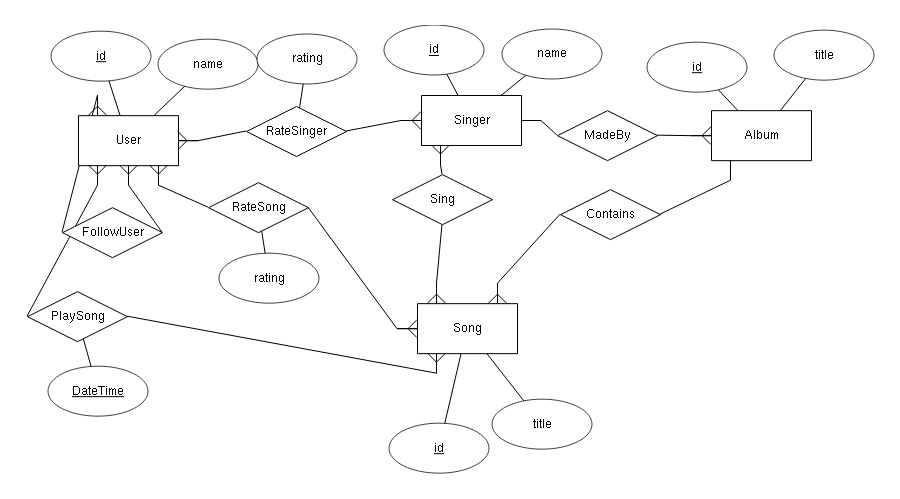
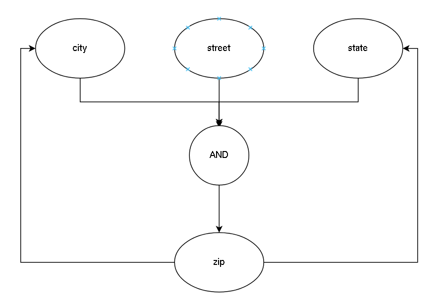

# Exercise 1 (ER Approach)
- Operation(~~type-of-op~~, normal duration)
- Surgeon(~~surg-id~~, surname, first-name)
- Patient(~~IC#~~,..., room#, ward#)
- Ward(~~ward#~~,blk#,level#,staff#)
- Nurse(~~staff#~~,first-name,surname,date-of-joining,ward#)
- Room(~~room#~~,~~ward#~~,attached-bath,size,no-of-beds)
- Op-rec(~~date-time~~,~~surg-id~~,~~type-of-op~~,~~IC#~~)
- Cardiology(~~ward#~~)
- Pardiatrics(~~ward#~~, no-of-nurseries)
- Surgical(~~ward#~~, no-of-ICU-rooms)
- StudentNurse(~~staff#~~, yr-of-study)
- RegisteredNurse(~~staff#~~, rank, yr-of-graduation)

# Exercise 2


# Exercise 3
### A
```
studentID -> {email, office, officePhone, name}
officePhone -> {office}
couresID -> {name, description, location}
name -> description
```
### B
Don't think you can derive any non-trivial ones.

# Exercise 4
### A


$\{zip,street\}^*=\{zip,street,city,state\}$

### b
- $\{zip,street\}$
- $\{city,street,state\}$

# Exercise 5
### A
```
A -> B
AC -> BC (Augmentation)
AC -> B  (Relexivity)
```

### B
| A | B | C |
| - | - | - |
| 1 | 1 | 1 |
| 2 | 1 | 2 |

