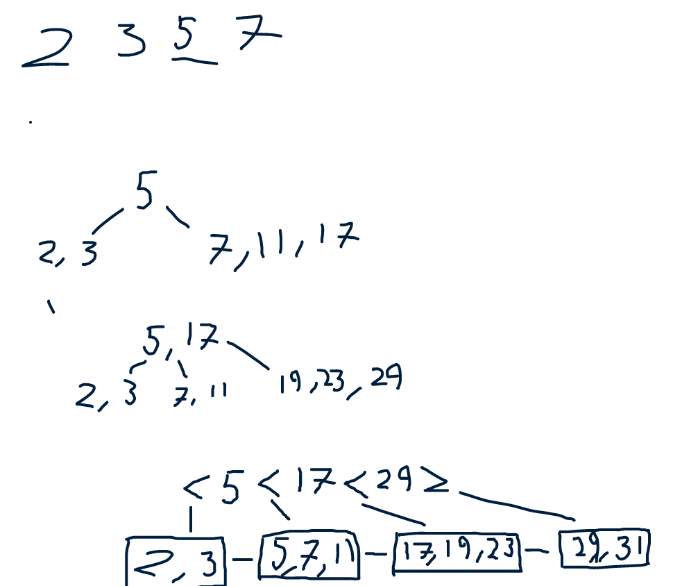

# Exercise 1
During insertion if something has been deleted we would stop if we do not have tombstones.

# Exercise 2
Probably not very efficient space wise.

Name and age attributes may give the same ordering example. (Benjamin, 22), (Claus, 33), (Derek, 44).

# Exercise 3

# Exercise 4
1. Would be useful to have an index on false should be dense, semester
2. either achieved points or max points
3. eid
